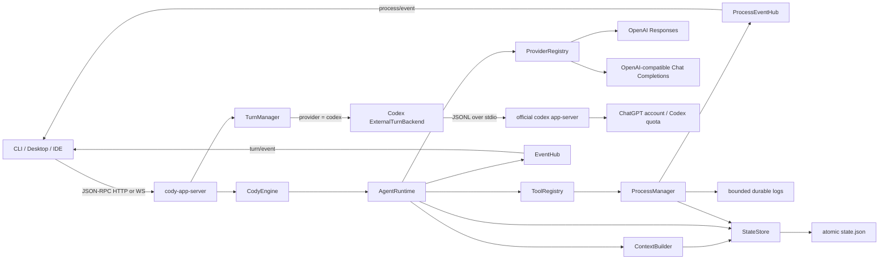
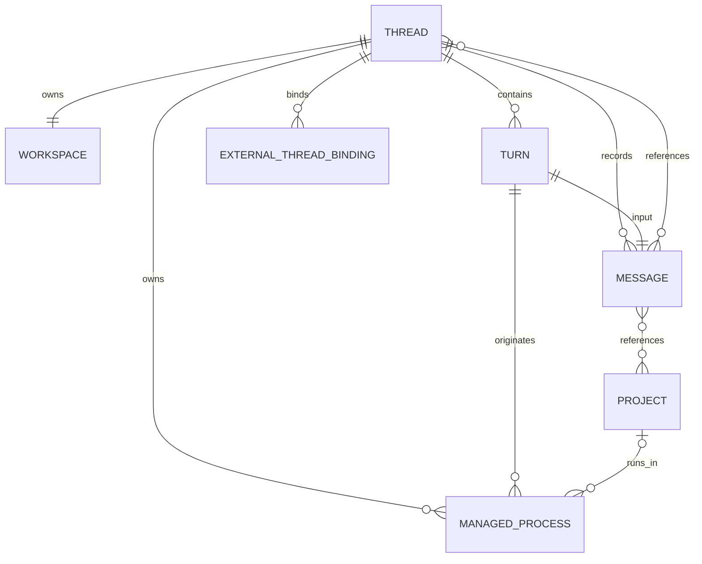
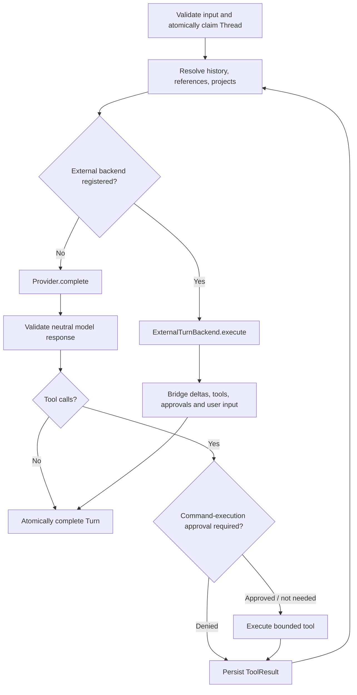

# Architecture

## Boundaries

`cody-core` does not depend on HTTP or WebSocket. The App Server is a transport adapter over `CodyEngine`, so a desktop application can embed the engine and subscribe to the same events directly.

There are deliberately two execution paths. Native `ModelProvider` adapters run inside Cody's own Agent Loop and return provider-neutral completions. The `codex` selection is routed to an `ExternalTurnBackend`: official Codex owns its agent loop and tool protocol, while Cody owns Thread state, context bindings, cancellation, client-facing events, approvals, and structured user input. Treating Codex as a raw completion endpoint would break both its account boundary and its execution semantics.

## Domain relationships

The important ownership rules are:

1. A Thread owns exactly one Workspace. Project paths are never repurposed as the Workspace.
2. A Project is a durable user asset and may be referenced by many Threads.
3. References are stored on the user message where they were mentioned. Later turns fold earlier references into the Thread context. A Project supplied during `thread/create` is stored in `Thread.default_references`.
4. Referenced Thread messages are resolved at prompt-build time and remain owned by their source Thread.
5. A Thread has at most one active Turn. Store-level compare-and-set transitions enforce this independently of the server task map.
6. A desktop draft is not a domain entity. `thread/create-and-start` materializes Thread, Workspace, optional Project, user Message, and first Turn only on Send; its client request ID is process-locally idempotent.
7. A Managed Process belongs to one Thread and records the Turn/tool-call origin that created it. Its lifecycle is independent from that Turn, so cancellation never implicitly kills a successfully started process.
8. External Thread IDs are opaque values namespaced by backend ID. A Cody Thread may resume the same Codex Thread without making Codex authentication or wire state part of Cody's domain model.

## Agent loop

Every model/tool/terminal transition emits a sequenced `EventEnvelope`. Cancellation is checked before provider calls, after provider responses, while waiting for approval, and inside built-in tools. Provider and tool panics inside the loop are converted into a failed Turn; terminal cleanup releases the Thread reservation.

After the first successful Turn, title enrichment runs outside the terminal path. `ThreadTitleGenerator` is replaceable by a provider-backed implementation, while the deterministic local generator is always available as fallback. A title failure never changes the completed Turn result.

## Managed process lifecycle

`start_process` is an explicit model tool rather than shell syntax hidden behind `&`. The manager assigns one actor to each child, starts it in an independent Unix process group, continuously drains both output pipes, and persists a bounded binary log addressed by byte cursor. A forked parent-death guardian sits in its own session and watches a CLOEXEC lifeline; if the app server crashes or is force-killed, the guardian kills the registered process group. `list_processes`, `read_process_output`, and `stop_process` complete the model-visible lifecycle; equivalent read/stop RPCs serve clients.

Process events have a per-process sequence and a separate broadcast channel, so long-running output cannot consume the bounded Turn event buffer. Lifecycle notifications trigger a durable `thread/get` reconciliation, while output notifications only advance a cursor; clients fetch bytes in bounded pages. A graceful app-server shutdown cancels active Turns first, then sends `SIGTERM` to every managed group and escalates to `SIGKILL` after the configured grace period.

The command must remain in the foreground of its managed process group. The supervisor owns crash cleanup and treats output pipes that do not close within the bounded drain period as a lifecycle failure rather than hanging shutdown indefinitely.

## Provider abstraction and catalogs

`ModelProvider` consumes provider-neutral `ModelRequest` values and returns `ModelResponse`. Provider-specific authentication, URL formats and wire payloads remain inside the adapter. `ModelDeltaSink` allows a streaming Provider to emit text, reasoning, and tool deltas while non-streaming Providers can emit their completed output through the same path.

The public catalog is also provider-neutral:

- `ProviderDescriptor` exposes ID, display name, adapter kind, authentication state, capabilities, and an optional default model. It never contains credential values.
- `ModelDescriptor` exposes an opaque model ID, display name, default marker, and optional description, owner, creation time, and supported/default reasoning effort.
- `list_models` may query the upstream catalog and fall back to explicitly configured model IDs when an upstream catalog is unavailable.
- `health` reports `healthy`, `degraded`, or `unavailable` without revealing secrets.

The built-in native adapters are:

- OpenAI Responses: streaming Responses API events, reasoning deltas, multiple tool calls, structured upstream failures, model catalog discovery, and cancellation.
- OpenAI-compatible: bounded non-streaming `/chat/completions` for compatible gateways and local servers.

Provider selection and model selection are separate:

- `provider` selects a registered adapter instance.
- `model` is opaque to the core and passed to that adapter.
- If omitted, `ModelProvider::default_model` is used.

The registry replaces a provider atomically. `prepare_turn` resolves the adapter and retains an `Arc` lease keyed by Turn ID, so replacing or removing a Profile cannot change an already queued Turn; future Turns observe the new registry state.

## Codex external Turn backend

`CodexService` lazily discovers a usable official `codex` binary, starts one long-lived `codex app-server --listen stdio://` child, performs the initialize handshake, and probes `account/read`. An explicit `CODY_CODEX_PATH` is authoritative and fails closed when unusable. Without it, Cody probes candidates from `PATH` and known ChatGPT application bundles, tries parseable Codex versions from newest to oldest, and falls back only when a newer candidate fails its protocol/account capability probe. This prevents an older PATH installation from shadowing a newer compatible bundled server.

The sidecar is the authentication authority. Cody uses its account login/logout and rate-limit methods, model catalog, Thread/Turn methods, notifications, server requests, and interruption method. It never reads `~/.codex/auth.json`, receives an OAuth/refresh token, or converts a ChatGPT token into an API key. The trusted host may set `CODY_CODEX_SERVICE_TIER` (`fast` or `flex`) and `CODY_CODEX_PATH`; neither control is available to Renderer content.

For a Codex Turn, Cody resolves its normal Workspace and reference context, starts or resumes the opaque external Thread binding, selects the requested model, sets the Workspace as `cwd`, and sends a workspace-write sandbox policy whose writable roots are the Thread Workspace plus only read-write Project bindings. Network access is disabled in that policy. Codex notifications become Cody model/reasoning/tool/file events. A Cody cancellation interrupts the remote Turn, and dropping an in-flight backend future also arms a best-effort interrupt guard.

Codex command and file-change approval requests enter the same `ApprovalBroker` used by native tools. Codex `requestUserInput` server requests enter `UserInputBroker`; public question metadata can be recovered from `thread/get`, but submitted answers travel only through a one-shot channel to the waiting sidecar request.

## Desktop credential and IPC boundary

The Electron Renderer may list providers/models and choose them for a Turn, but it cannot call `provider/configure`, `provider/remove`, `provider/health`, or Codex account mutation methods through the generic RPC bridge. Dedicated main-process IPC handlers validate settings input and perform privileged operations over the authenticated private server connection.

Provider Profile metadata is persisted by atomic same-directory replacement. API keys are write-only Renderer inputs encrypted with Electron `safeStorage`; public snapshots contain only `hasSecret`. Unix directory/file modes are tightened to `0700`/`0600`. On Linux, credential writes fail closed when encryption cannot be verified or the selected backend is `basic_text`. On server reconnect the main process removes all non-built-in runtime providers and rebuilds the registry exactly from the encrypted durable snapshot, preventing deleted or changed credentials from remaining active.

The App Server token and recognized provider API-key variables are removed from ambient environment state after their owning components consume them. Tool and Managed Process environments are allowlisted; the Electron main process also removes secret-shaped ambient variables before launching the App Server. Consequently the lazily started Codex sidecar cannot inherit Cody's server token or configured Provider keys. Provider and Codex error surfaces are redacted and bounded before entering logs, RPC responses, or public events.

## Interactive gates

Approvals and structured user input are runtime brokers rather than model messages:

- Pending approvals expose only tool identity, bounded public arguments, and a reason. `approval/respond` resolves a single waiting operation.
- Pending user input exposes question metadata and an `is_secret` presentation hint. `user-input/respond` validates a complete bounded answer map, removes it from broker state, and sends it only to the waiting backend.
- Public `user_input_resolved` events carry only the interaction ID and cancellation flag. Answers are never echoed into events, Thread snapshots, validation errors, or persisted conversation state.
- Terminal Turn cleanup removes unresolved broker entries so a failed or cancelled backend cannot leave actionable prompts behind.

## Context construction

The default builder combines:

1. System instructions and authoritative Workspace/Project bindings.
2. Direct referenced Thread data as prior user-level JSON reference messages.
3. The current Thread's linear message history.

Referenced content is never inserted into the system instruction and is JSON escaped to reduce delimiter/prompt-injection elevation. Current history is retained in complete Turn groups so a ToolResult is not separated from its ToolCall. Independent budgets cap current history, each reference, total reference material, and reference counts.

## State and recovery

`JsonFileStore` uses an in-memory candidate for each mutation, validates it, writes a versioned same-directory temporary snapshot, calls `fsync`, atomically renames it, then publishes the candidate to readers. A failed write leaves live state unchanged. On startup, malformed snapshots and broken relationships fail closed.

If the app server stopped after a Turn was queued or running, `CodyEngine::new` marks that Turn failed with a restart reason and returns its Thread to idle. Managed process metadata is recovered independently: an active record from an interrupted runtime becomes `Lost` and an old PID is never re-adopted or signalled, avoiding PID-reuse hazards. Process output lives outside `state.json` in a bounded, permission-restricted log.

For multi-process or remote deployments, implement the same `StateStore` trait with transactional compare-and-set semantics in SQLite/Postgres rather than sharing the JSON file.
