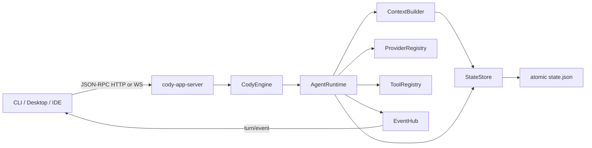
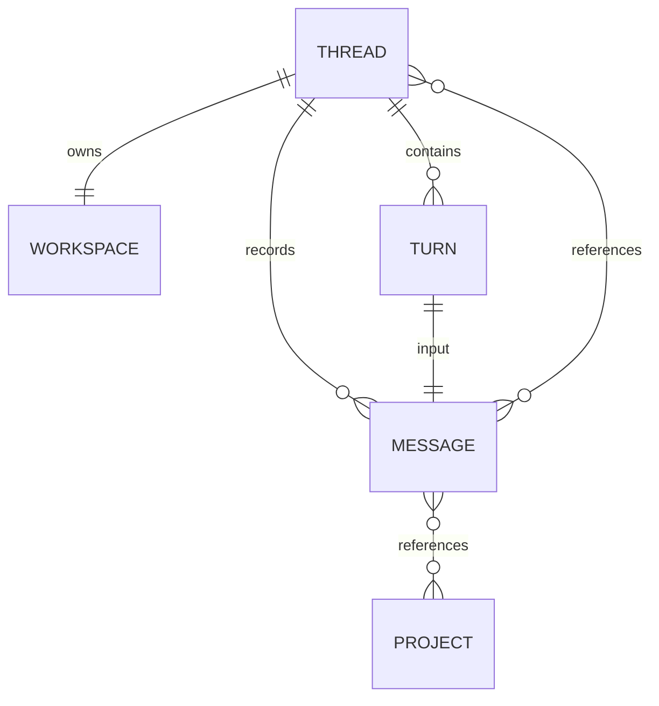
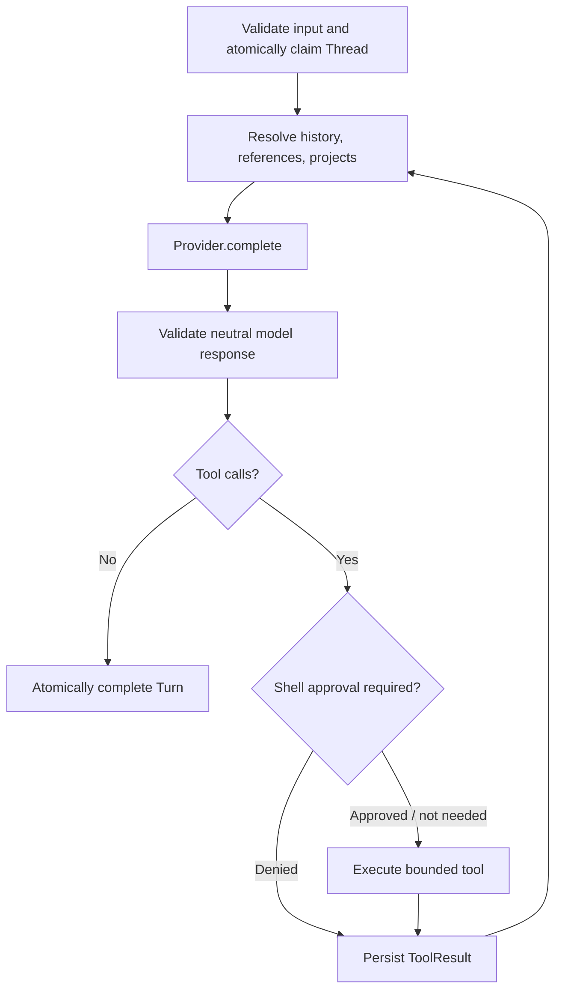

# Architecture

## Boundaries

`cody-core` does not depend on HTTP or WebSocket. The App Server is a transport adapter over `CodyEngine`, so a desktop application can embed the engine and subscribe to the same events directly.

## Domain relationships

The important ownership rules are:

1. A Thread owns exactly one Workspace. Project paths are never repurposed as the Workspace.
2. A Project is a durable user asset and may be referenced by many Threads.
3. References are stored on the user message where they were mentioned. Later turns fold earlier references into the Thread context. A Project supplied during `thread/create` is stored in `Thread.default_references`.
4. Referenced Thread messages are resolved at prompt-build time and remain owned by their source Thread.
5. A Thread has at most one active Turn. Store-level compare-and-set transitions enforce this independently of the server task map.

## Agent loop

Every model/tool/terminal transition emits a sequenced `EventEnvelope`. Cancellation is checked before provider calls, after provider responses, while waiting for approval, and inside built-in tools. Provider and tool panics inside the loop are converted into a failed Turn; terminal cleanup releases the Thread reservation.

## Provider abstraction

`ModelProvider` consumes provider-neutral `ModelRequest` values and returns `ModelResponse`. Provider-specific authentication, URL formats and wire payloads remain inside the adapter. `ModelDeltaSink` allows a streaming Provider to emit text/tool deltas while non-streaming Providers can emit their completed output through the same path.

Provider selection and model selection are separate:

- `provider` selects a registered adapter instance.
- `model` is opaque to the core and passed to that adapter.
- If omitted, `ModelProvider::default_model` is used.

## Context construction

The default builder combines:

1. System instructions and authoritative Workspace/Project bindings.
2. Direct referenced Thread data as prior user-level JSON reference messages.
3. The current Thread's linear message history.

Referenced content is never inserted into the system instruction and is JSON escaped to reduce delimiter/prompt-injection elevation. Current history is retained in complete Turn groups so a ToolResult is not separated from its ToolCall. Independent budgets cap current history, each reference, total reference material, and reference counts.

## State and recovery

`JsonFileStore` uses an in-memory candidate for each mutation, validates it, writes a versioned same-directory temporary snapshot, calls `fsync`, atomically renames it, then publishes the candidate to readers. A failed write leaves live state unchanged. On startup, malformed snapshots and broken relationships fail closed.

If the process stopped after a Turn was queued or running, `CodyEngine::new` marks that Turn failed with a restart reason and returns its Thread to idle. Completed history and references remain available.

For multi-process or remote deployments, implement the same `StateStore` trait with transactional compare-and-set semantics in SQLite/Postgres rather than sharing the JSON file.
